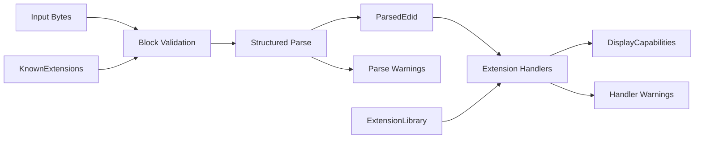

# PIAF

PIAF is a Rust library for reading and interpreting display capability data from EDID (Extended Display Identification Data) byte streams.

It accepts raw display identification bytes, validates and decodes them, and exposes the result as a typed `DisplayCapabilities` model. PIAF is designed as a small, modular building block for display and HDMI-adjacent interoperability projects.

## Quick start

```rust
use piaf::{parse_edid, capabilities_from_edid, ExtensionLibrary};

let bytes: Vec<u8> = std::fs::read("/sys/class/drm/card0-HDMI-A-1/edid")?;
let library = ExtensionLibrary::with_standard_handlers();
let parsed = parse_edid(&bytes, &library)?;
let caps = capabilities_from_edid(&parsed, &library);

println!("{:?} — {}x{} cm", caps.display_name, caps.width_cm.unwrap_or(0), caps.height_cm.unwrap_or(0));
```

## Core pipeline



## Extension system

The extension handler system is the main integration point for consumers. Handlers receive a raw 128-byte block and populate `DisplayCapabilities` directly:

```rust
use piaf::{ExtensionHandler, DisplayCapabilities, EdidWarning, ExtensionLibrary};

#[derive(Debug)]
struct MyHandler;

impl ExtensionHandler for MyHandler {
    fn process(&self, block: &[u8; 128], caps: &mut DisplayCapabilities, warnings: &mut Vec<EdidWarning>) {
        // inspect block, set fields on caps
    }
}

let mut library = ExtensionLibrary::new();
library.register(ExtensionMetadata {
    tag: 0x02,
    display_name: String::from("CEA-861"),
    handler: Some(Box::new(MyHandler)),
});
```

Base block parsing is also pluggable via `add_base_handler`, allowing the default `BaseBlockHandler` to be extended or replaced.

Custom typed data can be attached to `DisplayCapabilities` and retrieved by downstream code:

```rust
caps.set_extension_data(0x02, MyCeaData { version: block[1] });

if let Some(data) = caps.get_extension_data::<MyCeaData>(0x02) {
    println!("CEA version: {}", data.version);
}
```

See [`examples/inspect_displays.rs`](examples/inspect_displays.rs) for a complete working example.

## Design goals

- **Separation between parsing and normalization** — `ParsedEdid` preserves raw structure; `DisplayCapabilities` is the consumer-facing output
- **Pluggable extension handlers** — consumers register handlers without modifying the library
- **Structured diagnostics** — hard errors prevent parsing; warnings surface non-fatal issues from both the parser and handlers
- **`no_std` compatibility** — core modules avoid the standard library; `alloc` is used where dynamic allocation is needed
- **Optional `serde` support** — enable with `--features serde`

## Features

| Feature | Default | Description |
|---------|---------|-------------|
| `std`   | yes     | Enables `std`-backed types and the full extension system |
| `alloc` | no      | Enables dynamic allocation without `std` |
| `serde` | no      | Derives `Serialize`/`Deserialize` on public types |

## Status

The core pipeline is complete and tested against real hardware captures. The extension system is stable and open for consumer use.

Remaining work before a 0.1 release focuses on broader fixture coverage and conservative expansion of CEA-861 support.

## Documentation

Design and architecture notes live under [`doc/`](doc/):

- [`doc/architecture.md`](doc/architecture.md) — pipeline and layer overview
- [`doc/model.md`](doc/model.md) — data model and type design
- [`doc/extensibility.md`](doc/extensibility.md) — extension system guide
- [`doc/scope.md`](doc/scope.md) — scope and evolution strategy
- [`doc/testing.md`](doc/testing.md) — testing strategy and fuzzing
