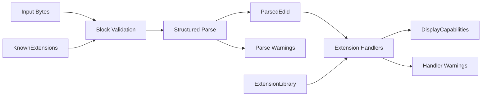

# PIAF

PIAF is a Rust library for reading and interpreting display capability data from EDID (Extended Display Identification Data) byte streams.

It accepts raw display identification bytes, validates and decodes them, and exposes the result as a typed `DisplayCapabilities` model. PIAF is designed as a small, modular building block for display and HDMI-adjacent interoperability projects.

## Quick start

```rust
use piaf::{parse_edid, capabilities_from_edid, ExtensionLibrary, ScreenSize};

let bytes: Vec<u8> = std::fs::read("/sys/class/drm/card0-HDMI-A-1/edid")?;
let library = ExtensionLibrary::with_standard_handlers();
let parsed = parse_edid(&bytes, &library)?;
let caps = capabilities_from_edid(&parsed, &library);

println!("{:?}", caps.display_name);
if let Some(ScreenSize::Physical { width_cm, height_cm }) = caps.screen_size {
    println!("{}x{} cm", width_cm, height_cm);
}
```

## Core pipeline



## Extension system

The extension handler system is the main integration point for consumers. Handlers receive a raw 128-byte block and populate `DisplayCapabilities` directly:

```rust
use piaf::{ExtensionHandler, DisplayCapabilities, EdidWarning, ExtensionLibrary};

#[derive(Debug)]
struct MyHandler;

impl ExtensionHandler for MyHandler {
    fn process(&self, block: &[u8; 128], caps: &mut DisplayCapabilities, warnings: &mut Vec<EdidWarning>) {
        // inspect block, set fields on caps
    }
}

let mut library = ExtensionLibrary::new();
library.register(ExtensionMetadata {
    tag: 0x02,
    display_name: String::from("CEA-861"),
    handler: Some(Box::new(MyHandler)),
});
```

Base block parsing is also pluggable via `add_base_handler`, allowing the default `BaseBlockHandler` to be extended or replaced.

Custom typed data can be attached to `DisplayCapabilities` and retrieved by downstream code:

```rust
caps.set_extension_data(0x02, MyCeaData { version: block[1] });

if let Some(data) = caps.get_extension_data::<MyCeaData>(0x02) {
    println!("CEA version: {}", data.version);
}
```

See [`examples/inspect_displays.rs`](examples/inspect_displays.rs) for a complete working example.

## Design goals

- **Separation between parsing and normalization** — `ParsedEdid` preserves raw structure; `DisplayCapabilities` is the consumer-facing output
- **Pluggable extension handlers** — consumers register handlers without modifying the library
- **Structured diagnostics** — hard errors prevent parsing; warnings surface non-fatal issues from both the parser and handlers
- **`no_std` compatibility** — core modules avoid the standard library; `alloc` is used where dynamic allocation is needed
- **Optional `serde` support** — enable with `--features serde`

## Features

| Feature | Default | Description |
|---------|---------|-------------|
| `std`   | yes     | Enables `std`-backed types and the full extension system |
| `alloc` | no      | Enables dynamic allocation without `std` |
| `serde` | no      | Derives `Serialize`/`Deserialize` on public types |

## Base block decoding

Fields decoded by `BaseBlockHandler`:

| Field | Source | Notes |
|-------|--------|-------|
| Manufacturer ID | bytes `0x08`–`0x09` | Three-character PNP code; `InvalidManufacturerId` warning if out of range |
| Product code | bytes `0x0A`–`0x0B` | 16-bit little-endian |
| Serial number | bytes `0x0C`–`0x0F` | 32-bit little-endian |
| Manufacture date | bytes `0x10`–`0x11` | Week + year, model year, or unspecified |
| EDID version | bytes `0x12`–`0x13` | Version and revision |
| Input type | byte `0x14` | Digital/analog flag; interface type, color bit depth (digital); sync level (analog) |
| Screen size | bytes `0x15`–`0x16` | Physical dimensions in cm, or landscape/portrait aspect ratio |
| Chromaticity | bytes `0x19`–`0x22` | 10-bit CIE xy coordinates for R, G, B, and white point |
| Display gamma | byte `0x17` | Encoded as `(value + 100) / 100`; absent if byte is `0xFF` |
| Display features | byte `0x18` | DPMS states, preferred timing mode, sRGB default, continuous timings |
| Color encoding | byte `0x18` bits 4–3 | RGB/YCbCr variants for EDID 1.4+ digital; analog color type otherwise |
| Established timings I/II | bytes `0x23`–`0x25` | Bitmap of 17 legacy modes decoded as `VideoMode` entries |
| Established timings III | descriptor `0xF7` | Extended bitmap of 44 additional VESA modes |
| Standard timings | bytes `0x26`–`0x35` | Up to 8 resolution + refresh rate pairs decoded as `VideoMode` entries |
| Detailed timing descriptors | slots `0x36`, `0x48`, `0x5A`, `0x6C` | Full DTD parameters decoded as `VideoMode`; first non-zero image size sets `preferred_image_size_mm` |
| Monitor name | descriptor `0xFC` | Display name string |
| Serial number string | descriptor `0xFF` | Serial number as text |
| Unspecified text | descriptor `0xFE` | Manufacturer-defined ASCII string |
| Display range limits | descriptor `0xFD` | Min/max H and V rates, max pixel clock, GTF/CVT timing formula |
| Additional white points | descriptor `0xFB` | Up to two additional white point entries with optional gamma |
| Color management data | descriptor `0xF9` | DCM polynomial coefficients for R, G, and B channels |

## CEA-861 coverage

Data blocks decoded by `Cea861Handler`:

| Tag | Block | Notes |
|-----|-------|-------|
| `0x01` | Audio Data Block | Short Audio Descriptors (SADs) |
| `0x02` | Video Data Block | VICs 1–127 (standard SVDs) and 128–255 (extended SVDs) |
| `0x03` | Vendor-Specific Data Block | HDMI 1.x VSDB (OUI `0x000C03`); HDMI Forum VSDB (OUI `0xC45DD8`) |
| `0x04` | Speaker Allocation Data Block | Three-byte channel presence bitmask |
| `0x05` | VESA Display Transfer Characteristic | 8/10/12-bit packed luminance points |
| `0x07` ext `0x00` | Video Capability Data Block | Quantization range and overscan flags |
| `0x07` ext `0x01` | Vendor-Specific Video Data Block | IEEE OUI + opaque vendor payload (e.g. Dolby Vision) |
| `0x07` ext `0x02` | VESA Display Device Data Block | Interface type, clock range, native resolution, audio, color depth |
| `0x07` ext `0x03` | VESA Video Timing Block Extension | DTBs, CVT, and Standard Timing entries as `VideoMode` |
| `0x07` ext `0x05` | Colorimetry Data Block | xvYCC, sYCC, opRGB, BT.2020 variants |
| `0x07` ext `0x06` | HDR Static Metadata Data Block | EOTFs and luminance levels |
| `0x07` ext `0x07` | HDR Dynamic Metadata Data Block | HDR10+, Dolby Vision application types |
| `0x07` ext `0x0D` | Video Format Preference Data Block | Short Video References (SVRs) |
| `0x07` ext `0x0E` | YCbCr 4:2:0 Video Data Block | 4:2:0-only VICs |
| `0x07` ext `0x0F` | YCbCr 4:2:0 Capability Map | Per-VIC 4:2:0 capability bitmap |
| `0x07` ext `0x12` | HDMI Audio Data Block | Multi-stream audio flag and embedded SADs |
| `0x07` ext `0x13` | Room Configuration Data Block | Speaker count and location availability |
| `0x07` ext `0x14` | Speaker Location Data Block | Per-channel assignment and distance |
| `0x07` ext `0x11` | Vendor-Specific Audio Data Block | IEEE OUI + opaque vendor payload |
| `0x07` ext `0x22` | DisplayID Type VII Video Timing Data Block | Single 20-byte DisplayID timing descriptor decoded to `VideoMode` |
| `0x07` ext `0x23` | DisplayID Type VIII Video Timing Data Block | VESA DMT ID codes decoded via built-in 0x01–0x58 lookup table |
| `0x07` ext `0x2A` | DisplayID Type X Video Timing Data Block | CVT formula-based timings; 6/7/8-byte descriptors; refresh up to 1024 Hz |
| `0x07` ext `0x78` | HDMI Forum EDID Extension Override Data Block | 1-byte extension count override for HDMI 2.1 sinks |
| `0x07` ext `0x79` | HDMI Forum Sink Capability Data Block | FRL rate, SCDC, Deep Color 4:2:0, ALLM, VRR range, DSC capabilities |
| `0x07` ext `0x20` | InfoFrame Data Block | Short InfoFrame Descriptors with OUI for VSI |

## Documentation

Design and architecture notes live under [`doc/`](doc/):

- [`doc/architecture.md`](doc/architecture.md) — pipeline and layer overview
- [`doc/model.md`](doc/model.md) — data model and type design
- [`doc/extensibility.md`](doc/extensibility.md) — extension system guide
- [`doc/scope.md`](doc/scope.md) — scope and evolution strategy
- [`doc/testing.md`](doc/testing.md) — testing strategy and fuzzing
- [`doc/cea861-vsdb.md`](doc/cea861-vsdb.md) — VSDB wire formats (HDMI 1.x and HDMI Forum)
- [`doc/cea861-extended-tags.md`](doc/cea861-extended-tags.md) — extended tag block wire formats
- [`doc/roadmap.md`](doc/roadmap.md) — planned features and future work
