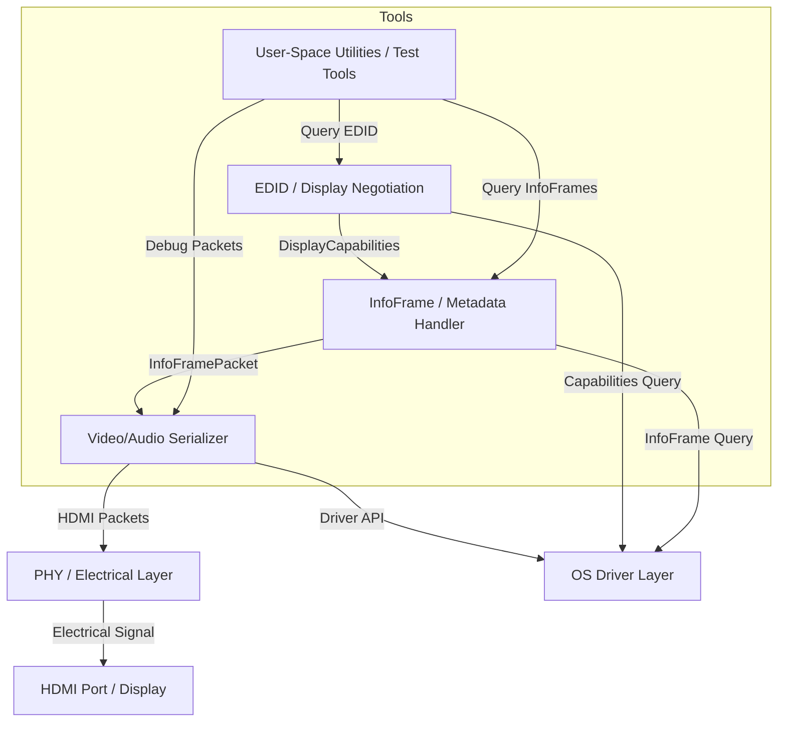

# PIAF

PIAF is a Rust library for reading and interpreting display capability data, starting with EDID.

Its initial goal is to accept raw display identification bytes, validate and decode them, and expose the result as a typed, consumer-friendly `DisplayCapabilities` model. PIAF is intended to be a small, modular building block for a broader family of display and HDMI-adjacent interoperability projects.

## Scope

The first milestone of PIAF focuses on:

- accepting raw EDID byte data,
- validating structure and checksums,
- decoding the base block,
- handling extension blocks conservatively,
- deriving a stable `DisplayCapabilities` representation.

PIAF is not currently intended to be a full HDMI stack, a kernel driver, or a hardware transport implementation.

## Design goals

- **Small, composable modules** with clear boundaries
- **Typed Rust APIs** instead of ad-hoc byte handling
- **Separation between parsing and normalization**
- **Structured diagnostics** for malformed or unusual data
- **Practical behavior** when encountering imperfect real-world inputs
- **`no_std` compatibility** to support embedded and low-level environments
- **Optional `serde` support** for serialization of display models

## Architecture

PIAF is expected to evolve around a few clear layers:



### Planned layers

- **Input layer**  
  Obtains raw EDID bytes from a caller or future transport-specific integrations.

- **Parser layer**  
  Validates and decodes EDID blocks into a structured intermediate representation.

- **Model layer**  
  Defines stable Rust types such as `ParsedEdid` and `DisplayCapabilities`.

- **Normalization layer**  
  Converts low-level parsed data into a clean, consumer-friendly capabilities model.

- **Diagnostics layer**  
  Reports errors and non-fatal warnings in a structured form.

## API direction

The library is expected to expose a split between raw parsing and higher-level capability derivation:
```rust
rust pub fn parse_edid(bytes: &[u8]) -> Result<ParsedEdid, EdidError>; pub fn capabilities_from_edid(edid: &ParsedEdid) -> DisplayCapabilities;
```
This keeps the lower-level representation available while also providing a stable higher-level API for downstream consumers.

## Early roadmap

### v0.1

- Parse a single EDID base block
- Validate header and checksum
- Decode core identification fields
- Decode basic display parameters
- Extract common descriptors such as display name
- Produce `ParsedEdid`
- Derive `DisplayCapabilities`

### Later milestones

- Extension block handling
- More robust normalization of timing and capability data
- Better diagnostics for broken or unusual inputs
- Test fixtures from real hardware captures
- Optional integration helpers for platform-specific probing

## Documentation

Additional design and architecture notes live under [`doc/`](doc/):

- [`doc/architecture.md`](doc/architecture.md)
- [`doc/scope.md`](doc/scope.md)
- [`doc/model.md`](doc/model.md)
- [`doc/testing.md`](doc/testing.md)

## Status

PIAF is in an early design stage. The current focus is on defining a clean crate structure, a stable data model, and a parser that is strict where necessary but practical in the face of real-world input.
