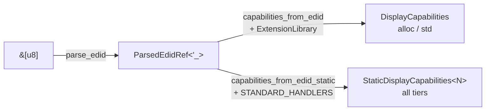

# PIAF

[](https://github.com/DracoWhitefire/piaf/actions/workflows/ci.yml)
[](https://crates.io/crates/piaf)
[](https://docs.rs/piaf)
[](https://github.com/DracoWhitefire/piaf/blob/main/LICENSE)
[](https://blog.rust-lang.org/2025/02/20/Rust-1.85.0.html)
[](https://slsa.dev)

A Rust library for decoding binary capability data into a clean, typed model, specialized for EDID.

PIAF reads raw EDID bytes — from a file, a kernel sysfs node, or a direct I²C read —
and produces a `DisplayCapabilities` value with all the information a display or
HDMI-adjacent application typically needs: identity, input type, supported modes,
color characteristics, HDR metadata, audio capabilities, and more.

Decoding happens in two steps. `parse_edid` validates the raw bytes and returns a
`ParsedEdidRef<'_>` — a zero-copy view that borrows the block structure directly from the
input slice. `capabilities_from_edid` then runs the registered extension handlers over that
structure and produces a `DisplayCapabilities` — the typed, stable model your application
works with. Keeping these steps separate means you can inspect the raw parse result for
debugging, or run multiple handler configurations over the same parsed data without re-parsing.
Use `parse_edid_owned` to get an owned `ParsedEdid` that can outlive the input buffer.

```rust
use piaf::{parse_edid, capabilities_from_edid, ExtensionLibrary, ScreenSize};

let bytes = std::fs::read("/sys/class/drm/card0-HDMI-A-1/edid")?;
let library = ExtensionLibrary::with_standard_handlers();
let parsed = parse_edid(&bytes, &library)?;
let caps = capabilities_from_edid(&parsed, &library);

println!("Display: {}", caps.display_name.as_deref().unwrap_or("unknown"));
if let Some(ScreenSize::Physical { width_cm, height_cm }) = caps.screen_size {
    println!("{}×{} cm", width_cm, height_cm);
}
for mode in &caps.supported_modes {
    println!("  {}×{}@{}", mode.width, mode.height, mode.refresh_rate);
}
```

See [`examples/inspect_displays.rs`](examples/inspect_displays.rs) for a more complete example.



## Why PIAF

**Complete extension coverage.** Most EDID libraries decode the base block and stop.
PIAF decodes 20+ CEA-861 data block types — HDR static and dynamic metadata, HDMI 1.x
and HDMI Forum VSDBs, colorimetry, speaker allocation, video timing blocks, and the HDMI
Forum Sink Capability block — all 20 defined DisplayID 1.x block types, and the full
DisplayID 2.x block set including Type VII/VIII/IX timings, dynamic timing range, display
interface features, stereo, tiled topology, ContainerID, vendor-specific, and the CTA
DisplayID block (`0x81`) which embeds CTA-861 data inside a DisplayID section. If the
information is in the EDID, PIAF exposes it as typed fields rather than raw bytes.

**Pluggable handlers.** The extension handler system lets you register your own handler
for any extension block tag — override either built-in handler (CEA-861 or DisplayID),
add support for a proprietary block, or attach typed custom data to `DisplayCapabilities`
for downstream consumers. Base block parsing is pluggable too.

**Honest diagnostics.** PIAF distinguishes between hard parse errors (invalid header,
checksum failure, truncated input) and non-fatal warnings (unknown extension block,
malformed data block, out-of-range manufacturer ID). You decide how strict to be;
nothing is silently discarded.

**`no_std` support.** The library runs on bare metal. The static extension handler
pipeline — `capabilities_from_edid_static` with `STANDARD_HANDLERS` — works at all
build tiers, including bare `no_std` without an allocator. Custom handlers implement
`StaticExtensionHandler` using `static` references instead of `Box` — see
[`no_std` builds](#no_std-builds) below.

**Stable consumer model.** `ParsedEdidRef` and `ParsedEdid` preserve raw bytes;
`DisplayCapabilities` is the typed, stable output. Both implement `EdidSource` and work
directly with the capability pipelines. Parser improvements don't change the consumer-facing API.

## Extension system

`Cea861Handler` covers the common case. Write your own handler to support a proprietary
extension block, augment CEA-861 decoding with application-specific logic, or attach typed
custom data to `DisplayCapabilities` for downstream consumers.

### Dynamic handlers (`std`/`alloc`)

Register via `ExtensionLibrary`. Uses `Box<dyn ExtensionHandler>` internally, so requires
heap allocation:

```rust
use piaf::{ExtensionHandler, DisplayCapabilities, ParseWarning, ExtensionLibrary};

#[derive(Debug)]
struct MyHandler;

impl ExtensionHandler for MyHandler {
    fn process(&self, blocks: &[&[u8; 128]], caps: &mut DisplayCapabilities, warnings: &mut Vec<ParseWarning>) {
        // inspect blocks, set fields on caps
    }
}

let mut library = ExtensionLibrary::new();
library.register(ExtensionMetadata {
    tag: 0xAB,
    display_name: String::from("My Extension"),
    handler: Some(Box::new(MyHandler)),
});
```

Typed data can be attached to `DisplayCapabilities` and retrieved by tag:

```rust
caps.set_extension_data(0xAB, MyCeaData { version: block[1] });

if let Some(data) = caps.get_extension_data::<MyCeaData>(0xAB) {
    println!("version: {}", data.version);
}
```

### Static handlers (no-alloc)

Use `StaticExtensionHandler` when heap allocation is unavailable. Pass a `static` slice
to `capabilities_from_edid_static`:

```rust
use piaf::{StaticExtensionHandler, ModeSink, StaticDisplayCapabilities, STANDARD_HANDLERS};

struct MyHandler;

impl StaticExtensionHandler for MyHandler {
    fn tag(&self) -> u8 { 0xAB }
    fn process(&self, blocks: &[&[u8; 128]], ctx: &mut StaticContext<'_>) {
        // push modes via ctx.push_mode(...) and warnings via ctx.push_warning(...)
    }
}

static MY_HANDLER: MyHandler = MyHandler;
static HANDLERS: &[&dyn StaticExtensionHandler] = &[STANDARD_HANDLERS[0], &MY_HANDLER];

let caps: StaticDisplayCapabilities<64> =
    piaf::capabilities_from_edid_static(&parsed, HANDLERS);
```

Static handlers extract modes only — audio, VSDB, colorimetry, and similar rich metadata
require the dynamic pipeline.

## Features

| Feature | Default | Description                                              |
|---------|---------|----------------------------------------------------------|
| `std`   | yes     | Enables `std`-backed types and the full extension system |
| `alloc` | no      | Enables dynamic allocation without `std`                 |
| `serde` | no      | Derives `Serialize`/`Deserialize` on public types        |

All output types (`DisplayCapabilities`, `VideoMode`, `ManufacturerId`, etc.) are defined in
the [`display-types`](https://crates.io/crates/display-types) crate and re-exported from
`piaf`. Importing from `piaf::*` is sufficient; adding `display-types` as a direct dependency
is only needed if you want to use the types in an API shared between piaf and other crates.

## `no_std` builds

Bare `no_std` (neither `std` nor `alloc`) is supported. The dynamic extension handler
pipeline (`ExtensionLibrary`, `capabilities_from_edid`) requires `alloc` or `std`.
The static pipeline (`capabilities_from_edid_static`) is available unconditionally.

In bare `no_std`, `parse_edid` returns a `ParsedEdidRef<'_>` that borrows extension blocks
directly from the input slice — no allocator needed. Both base-block fields and extension-block
modes are available through `capabilities_from_edid_static` at all build tiers.

`parse_edid_owned` returns a `ParsedEdid` that copies block bytes into owned storage; in bare
`no_std` the extension block field is absent (alloc-gated), so prefer `ParsedEdidRef` from
`parse_edid` when extension block access matters.

### Fields in `DisplayCapabilities` available in all build configurations

| Field                               | Type                                                        |
|-------------------------------------|-------------------------------------------------------------|
| `manufacturer`                      | `Option<ManufacturerId>`                                    |
| `manufacture_date`                  | `Option<ManufactureDate>`                                   |
| `edid_version`                      | `Option<EdidVersion>`                                       |
| `product_code`                      | `Option<u16>`                                               |
| `serial_number`                     | `Option<u32>`                                               |
| `serial_number_string`              | `Option<MonitorString>`                                     |
| `display_name`                      | `Option<MonitorString>`                                     |
| `unspecified_text`                  | `[Option<MonitorString>; 4]`                                |
| `white_points`                      | `[Option<WhitePoint>; 2]`                                   |
| `digital`                           | `bool`                                                      |
| `color_bit_depth`                   | `Option<ColorBitDepth>`                                     |
| `video_interface`                   | `Option<VideoInterface>`                                    |
| `analog_sync_level`                 | `Option<AnalogSyncLevel>`                                   |
| `chromaticity`                      | `Chromaticity`                                              |
| `gamma`                             | `Option<DisplayGamma>`                                      |
| `display_features`                  | `Option<DisplayFeatureFlags>`                               |
| `digital_color_encoding`            | `Option<DigitalColorEncoding>`                              |
| `analog_color_type`                 | `Option<AnalogColorType>`                                   |
| `screen_size`                       | `Option<ScreenSize>`                                        |
| `preferred_image_size_mm`           | `Option<(u16, u16)>`                                        |
| `min_v_rate` / `max_v_rate`         | `Option<u16>`                                               |
| `min_h_rate_khz` / `max_h_rate_khz` | `Option<u16>`                                               |
| `max_pixel_clock_mhz`               | `Option<u16>`                                               |
| `timing_formula`                    | `Option<TimingFormula>`                                     |
| `color_management`                  | `Option<ColorManagementData>`                               |
| `warnings`                          | `[Option<EdidWarning>; 8]` (first 8; use `iter_warnings()`) |

These fields are absent from `DisplayCapabilities` without `alloc` or `std`:

| Field             | Reason                                                                         |
|-------------------|--------------------------------------------------------------------------------|
| `supported_modes` | Variable-length list of video modes                                            |
| `extension_data`  | Type-erased handler data via `Arc<dyn ExtensionData>`                          |
| `warnings` (full) | `Vec<ParseWarning>` in alloc builds; use `iter_warnings()` for portable access |

**For supported modes without heap allocation**, use `capabilities_from_edid_static` instead.
It returns `StaticDisplayCapabilities<N>`, which holds all the scalar fields above plus a
fixed-capacity `[Option<VideoMode>; N]` array accessible via `iter_modes()`.

Fixed-length string fields (`MonitorString`, `ManufacturerId`) use fixed-size byte
array newtypes with `Display` and `Deref<Target = str>` impls, so they behave like
strings in all build configurations without requiring heap allocation.

## Base block decoding

Fields decoded by `BaseBlockHandler`:

| Field                       | Source                               | Notes                                                                                                |
|-----------------------------|--------------------------------------|------------------------------------------------------------------------------------------------------|
| Manufacturer ID             | bytes `0x08`–`0x09`                  | Three-character PNP code; `InvalidManufacturerId` warning if out of range                            |
| Product code                | bytes `0x0A`–`0x0B`                  | 16-bit little-endian                                                                                 |
| Serial number               | bytes `0x0C`–`0x0F`                  | 32-bit little-endian                                                                                 |
| Manufacture date            | bytes `0x10`–`0x11`                  | Week + year, model year, or unspecified                                                              |
| EDID version                | bytes `0x12`–`0x13`                  | Version and revision                                                                                 |
| Input type                  | byte `0x14`                          | Digital/analog flag; interface type, color bit depth (digital); sync level (analog)                  |
| Screen size                 | bytes `0x15`–`0x16`                  | Physical dimensions in cm, or landscape/portrait aspect ratio                                        |
| Chromaticity                | bytes `0x19`–`0x22`                  | 10-bit CIE xy coordinates for R, G, B, and white point                                               |
| Display gamma               | byte `0x17`                          | Encoded as `(value + 100) / 100`; absent if byte is `0xFF`                                           |
| Display features            | byte `0x18`                          | DPMS states, preferred timing mode, sRGB default, continuous timings                                 |
| Color encoding              | byte `0x18` bits 4–3                 | RGB/YCbCr variants for EDID 1.4+ digital; analog color type otherwise                                |
| Established timings I/II    | bytes `0x23`–`0x25`                  | Bitmap of 17 legacy modes decoded as `VideoMode` entries                                             |
| Established timings III     | descriptor `0xF7`                    | Extended bitmap of 44 additional VESA modes                                                          |
| Standard timings            | bytes `0x26`–`0x35`                  | Up to 8 resolution + refresh rate pairs decoded as `VideoMode` entries                               |
| Detailed timing descriptors | slots `0x36`, `0x48`, `0x5A`, `0x6C` | Full DTD parameters decoded as `VideoMode`; first non-zero image size sets `preferred_image_size_mm` |
| Monitor name                | descriptor `0xFC`                    | Display name string                                                                                  |
| Serial number string        | descriptor `0xFF`                    | Serial number as text                                                                                |
| Unspecified text            | descriptor `0xFE`                    | Manufacturer-defined ASCII string                                                                    |
| Display range limits        | descriptor `0xFD`                    | Min/max H and V rates, max pixel clock, GTF/CVT timing formula                                       |
| Additional white points     | descriptor `0xFB`                    | Up to two additional white point entries with optional gamma                                         |
| Color management data       | descriptor `0xF9`                    | DCM polynomial coefficients for R, G, and B channels                                                 |

## CEA-861 coverage

Data blocks decoded by `Cea861Handler`:

| Tag               | Block                                         | Notes                                                                    |
|-------------------|-----------------------------------------------|--------------------------------------------------------------------------|
| `0x01`            | Audio Data Block                              | Short Audio Descriptors (SADs)                                           |
| `0x02`            | Video Data Block                              | VICs 1–127 (standard SVDs) and 128–255 (extended SVDs)                   |
| `0x03`            | Vendor-Specific Data Block                    | HDMI 1.x VSDB (OUI `0x000C03`); HDMI Forum VSDB (OUI `0xC45DD8`)         |
| `0x04`            | Speaker Allocation Data Block                 | Three-byte channel presence bitmask                                      |
| `0x05`            | VESA Display Transfer Characteristic          | 8/10/12-bit packed luminance points                                      |
| `0x07` ext `0x00` | Video Capability Data Block                   | Quantization range and overscan flags                                    |
| `0x07` ext `0x01` | Vendor-Specific Video Data Block              | IEEE OUI + opaque vendor payload (e.g. Dolby Vision)                     |
| `0x07` ext `0x02` | VESA Display Device Data Block                | Interface type, clock range, native resolution, audio, color depth       |
| `0x07` ext `0x03` | VESA Video Timing Block Extension             | DTBs, CVT, and Standard Timing entries as `VideoMode`                    |
| `0x07` ext `0x05` | Colorimetry Data Block                        | xvYCC, sYCC, opRGB, BT.2020 variants                                     |
| `0x07` ext `0x06` | HDR Static Metadata Data Block                | EOTFs and luminance levels                                               |
| `0x07` ext `0x07` | HDR Dynamic Metadata Data Block               | HDR10+, Dolby Vision application types                                   |
| `0x07` ext `0x0D` | Video Format Preference Data Block            | Short Video References (SVRs)                                            |
| `0x07` ext `0x0E` | YCbCr 4:2:0 Video Data Block                  | 4:2:0-only VICs                                                          |
| `0x07` ext `0x0F` | YCbCr 4:2:0 Capability Map                    | Per-VIC 4:2:0 capability bitmap                                          |
| `0x07` ext `0x12` | HDMI Audio Data Block                         | Multi-stream audio flag and embedded SADs                                |
| `0x07` ext `0x13` | Room Configuration Data Block                 | Speaker count and location availability                                  |
| `0x07` ext `0x14` | Speaker Location Data Block                   | Per-channel assignment and distance                                      |
| `0x07` ext `0x11` | Vendor-Specific Audio Data Block              | IEEE OUI + opaque vendor payload                                         |
| `0x07` ext `0x22` | DisplayID Type VII Video Timing Data Block    | Single 20-byte DisplayID timing descriptor decoded to `VideoMode`        |
| `0x07` ext `0x23` | DisplayID Type VIII Video Timing Data Block   | VESA DMT ID codes decoded via built-in 0x01–0x58 lookup table            |
| `0x07` ext `0x2A` | DisplayID Type X Video Timing Data Block      | CVT formula-based timings; 6/7/8-byte descriptors; refresh up to 1024 Hz |
| `0x07` ext `0x78` | HDMI Forum EDID Extension Override Data Block | 1-byte extension count override for HDMI 2.1 sinks                       |
| `0x07` ext `0x79` | HDMI Forum Sink Capability Data Block         | FRL rate, SCDC, Deep Color 4:2:0, ALLM, VRR range, DSC capabilities      |
| `0x07` ext `0x20` | InfoFrame Data Block                          | Short InfoFrame Descriptors with OUI for VSI                             |

## DisplayID 1.x coverage

Data blocks decoded by `DisplayIdHandler` (extension tag `0x70`):

| Tag    | Block                        | Output                                                                                                                                                                                                                                                                                    |
|--------|------------------------------|-------------------------------------------------------------------------------------------------------------------------------------------------------------------------------------------------------------------------------------------------------------------------------------------|
| `0x00` | Product Identification       | `manufacturer`, `product_code`, `display_name`, `serial_number_string`, `manufacture_date` on `DisplayCapabilities`                                                                                                                                                                       |
| `0x01` | Display Parameters           | `preferred_image_size_mm`, `native_pixels` on `DisplayCapabilities`                                                                                                                                                                                                                       |
| `0x02` | Color Characteristics        | `chromaticity` on `DisplayCapabilities`                                                                                                                                                                                                                                                   |
| `0x03` | Type I Detailed Timings      | `supported_modes` (20-byte descriptors)                                                                                                                                                                                                                                                   |
| `0x04` | Type II Detailed Timings     | `supported_modes` (10-byte descriptors)                                                                                                                                                                                                                                                   |
| `0x05` | Type III Short Timings       | `supported_modes` (3-byte short descriptors)                                                                                                                                                                                                                                              |
| `0x06` | Type IV DMT/VIC Codes        | `supported_modes` via DMT ID and VIC code lookup                                                                                                                                                                                                                                          |
| `0x07` | VESA Video Timing Bitmap     | `supported_modes` via DMT ID presence bitmap (IDs 0x01–0x50)                                                                                                                                                                                                                              |
| `0x08` | CTA-861 Video Timing Bitmap  | `supported_modes` via VIC presence bitmap (VICs 1–64)                                                                                                                                                                                                                                     |
| `0x09` | Video Timing Range Limits    | `min_v_rate`, `max_v_rate`, `min_h_rate_khz`, `max_h_rate_khz`, `max_pixel_clock_mhz`                                                                                                                                                                                                     |
| `0x0A` | Product Serial Number        | `serial_number_string` on `DisplayCapabilities`                                                                                                                                                                                                                                           |
| `0x0B` | General Purpose ASCII String | collected as additional `unspecified_text` entries                                                                                                                                                                                                                                        |
| `0x0C` | Display Device Data          | `display_technology`, `operating_mode`, `backlight_type`, `native_pixels`, `physical_orientation`, `rotation_capability`, `zero_pixel_location`, `scan_direction`, `subpixel_layout`, `pixel_pitch_hundredths_mm`, `pixel_response_time_ms`, `data_enable_used`, `panel_aspect_ratio_100` |
| `0x0D` | Interface Power Sequencing   | `power_sequencing` (T1–T6 delays in 2 ms units)                                                                                                                                                                                                                                           |
| `0x0E` | Transfer Characteristics     | `transfer_characteristic` (8/10/12-bit luminance curve, single or per-channel)                                                                                                                                                                                                            |
| `0x0F` | Display Interface Data       | `display_id_interface` (type, lanes, pixel clock range, content protection)                                                                                                                                                                                                               |
| `0x10` | Stereo Display Interface     | `stereo_interface` (viewing mode, sync polarity, sync channel)                                                                                                                                                                                                                            |
| `0x11` | Type V Short Timings         | `supported_modes` (7-byte short descriptors)                                                                                                                                                                                                                                              |
| `0x12` | Tiled Display Topology       | `tiled_topology` (grid dimensions, tile location, optional bezel sizes)                                                                                                                                                                                                                   |
| `0x13` | Type VI Detailed Timings     | `supported_modes` (14-byte descriptors)                                                                                                                                                                                                                                                   |

All fields populated from DisplayID blocks land on `DisplayCapabilities` directly where they
overlap with EDID base block fields, or in the `DisplayIdCapabilities` struct retrievable via
`caps.get_extension_data::<DisplayIdCapabilities>(0x70)`.

## DisplayID 2.x coverage

DisplayID 2.x sections (version byte `0x20`) use a disjoint tag space at `0x20`–`0x29`,
`0x7E`, and `0x81`. Decoded by the same `DisplayIdHandler`:

| Tag    | Block                              | Output                                                                                                                         |
|--------|------------------------------------|--------------------------------------------------------------------------------------------------------------------------------|
| `0x20` | Product Identification             | `manufacturer_oui` (on `DisplayIdCapabilities`); `product_code`, `serial_number`, `manufacture_date`, `display_name` on `DisplayCapabilities` |
| `0x21` | Display Parameters                 | `display_params_v2` (chromaticity, luminance, gamma, display technology, scan orientation, audio routing); `preferred_image_size_mm`, `native_pixels`, `color_bit_depth` mirrored on `DisplayCapabilities` |
| `0x22` | Type VII Detailed Timing           | `supported_modes` (20-byte descriptors with 24-bit pixel clock)                                                                |
| `0x23` | Type VIII Enumerated Timing Code   | `supported_modes` via DMT/VIC/HDMI VIC lookup                                                                                  |
| `0x24` | Type IX Formula-Based Timing       | `supported_modes` with `cvt_algorithm` (CVT-RB1/RB2/RB3, RB-with-CVT-RB1/RB2) and `y420` flag from byte 0; pixel clock + blanking derivation deferred |
| `0x25` | Dynamic Video Timing Range Limits  | `dynamic_timing_range` (kHz precision pixel clock, VRR flag); `max_pixel_clock_mhz`, `min_v_rate`, `max_v_rate` mirrored        |
| `0x26` | Display Interface Features         | `interface_features` (per-encoding color depth bitmasks, audio flags, color space + EOTF)                                       |
| `0x27` | Stereo Display Interface           | `stereo_interface_v2` (Field Sequential, Side-by-Side, Pixel Interleaved, Dual Interface, Multi-View, Stacked Frame, Proprietary) |
| `0x28` | Tiled Display Topology             | `tiled_topology` (same wire format as 1.x `0x12`)                                                                              |
| `0x29` | ContainerID                        | `container_id` (raw 16-byte UUID)                                                                                              |
| `0x7E` | Vendor-Specific                    | `vendor_specific` (OUI + opaque payload, multiple records per section)                                                          |
| `0x81` | CTA DisplayID                      | merged into `Cea861Capabilities` at extension tag `0x02` (VICs, audio, HDR, colorimetry, etc.); modes in `supported_modes`     |

The 2.x Product Identification Block uses an IEEE OUI rather than a PNP ID; the OUI is
exposed as `did.manufacturer_oui` and `caps.manufacturer` is left untouched.

The `0x81` CTA DisplayID Block wraps a CTA-861 data block collection. Its decoded
contents merge into the same `Cea861Capabilities` instance the CEA-861 (`0x02`)
extension writes to, regardless of which extension is processed first — see
[`doc/displayid-2x.md`](doc/displayid-2x.md) for the merge semantics.

## Documentation

Extended documentation lives under [`doc/`](doc/).

**Understanding the library**

- [`doc/architecture.md`](doc/architecture.md) — scope, pipeline structure, layers, and design principles
- [`doc/model.md`](doc/model.md) — data types, field conventions, and the error/warning model

**Using the extension system**

- [`doc/extensibility.md`](doc/extensibility.md) — registering handlers, storing custom data, and emitting warnings
- [`doc/static-pipeline.md`](doc/static-pipeline.md) — static (no-alloc) pipeline API reference and custom handler examples
- [`doc/displayid-handler.md`](doc/displayid-handler.md) — DisplayID handler field mapping and 1.x timing block details
- [`doc/displayid-2x.md`](doc/displayid-2x.md) — DisplayID 2.x block-by-block field mapping, the `0x81` merge semantics, and warning variants

**Wire format reference**

- [`doc/cea861-vsdb.md`](doc/cea861-vsdb.md) — VSDB wire formats (HDMI 1.x and HDMI Forum)
- [`doc/cea861-extended-tags.md`](doc/cea861-extended-tags.md) — extended tag block wire formats
- [`doc/displayid-block-tags.md`](doc/displayid-block-tags.md) — DisplayID 1.x block tag assignments and wire formats
- [`doc/displayid-explained.md`](doc/displayid-explained.md) — DisplayID standard overview

**Contributing**

- [`doc/setup.md`](doc/setup.md) — build, test, and fuzzing setup
- [`doc/testing.md`](doc/testing.md) — testing strategy, fixture corpus, and CI
- [`doc/roadmap.md`](doc/roadmap.md) — planned features and future work

## Verifying releases

Each release is built on GitHub Actions and attested with
[SLSA Build Level 2](https://slsa.dev) provenance. To verify a release
`.crate` against its signed provenance, install the
[GitHub CLI](https://cli.github.com/) and run:

```sh
gh attestation verify piaf-X.Y.Z.crate --repo DracoWhitefire/piaf
```

The attested `.crate` is attached to each
[GitHub release](https://github.com/DracoWhitefire/piaf/releases).

## License

Licensed under the [Mozilla Public License 2.0](https://github.com/DracoWhitefire/piaf/blob/main/LICENSE).
