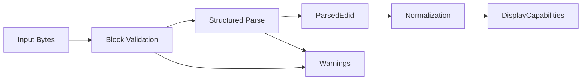

# Architecture

PIAF is organized as a small library with clear internal boundaries between byte-level parsing and higher-level capability modeling.

## Core pipeline

## Layers

### Input

The input layer is responsible only for obtaining byte buffers. In the earliest versions of PIAF, this is simply a caller-provided byte slice.

Future versions may include helpers for reading from platform-specific sources, but transport concerns should remain outside the core parser.

### Parser

The parser is responsible for:

- validating expected block sizes,
- checking structural markers,
- verifying checksums,
- decoding known fields into structured Rust types.

The parser should avoid embedding higher-level policy decisions where possible.

### Intermediate representation

`ParsedEdid` should preserve the structure of the decoded data closely enough to support inspection, debugging, and later refinement.

This representation is distinct from the end-user capability model.

### Normalization

The normalization layer converts parsed fields into a simpler, more stable `DisplayCapabilities` structure.

This layer is where PIAF can:

- combine related low-level fields,
- choose consumer-friendly defaults,
- represent partial knowledge explicitly,
- attach warnings for suspicious or inconsistent input.

### Diagnostics

Diagnostics should distinguish between:

- **hard errors**, which prevent useful parsing,
- **warnings**, which indicate malformed, unsupported, or suspicious but non-fatal data.

This distinction is important because real display data is often imperfect.

## Design principles

- Keep byte parsing deterministic and testable
- Keep capability modeling stable and ergonomic
- Avoid coupling transport, parsing, and policy logic
- Prefer explicit types over loosely structured maps or tuples

## Technical constraints

- **`no_std` compatibility**: The core library avoids the Rust standard library to remain usable in firmware, bootloaders, and embedded systems. `alloc` may be used where dynamic allocation is required (e.g., for extension block storage).
- **Zero-copy (where possible)**: The parser should aim to avoid unnecessary allocations, working directly with input byte slices.