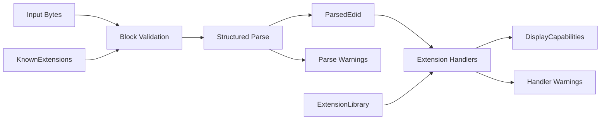

# Architecture

PIAF is organized as a small library with clear internal boundaries between byte-level parsing and higher-level capability modeling.

## Core pipeline



## Layers

### Input

The input layer is responsible only for obtaining byte buffers. In the earliest versions of PIAF, this is simply a caller-provided byte slice.

Future versions may include helpers for reading from platform-specific sources, but transport concerns should remain outside the core parser.

### Parser

The parser is responsible for:

- validating expected block sizes,
- checking structural markers,
- verifying checksums,
- decoding known fields into structured Rust types.

The parser should avoid embedding higher-level policy decisions where possible.

### Intermediate representation

`ParsedEdid` should preserve the structure of the decoded data closely enough to support inspection, debugging, and later refinement.

This representation is distinct from the end-user capability model.

### Normalization

The normalization layer converts parsed fields into a simpler, more stable `DisplayCapabilities` structure via a set of pluggable `ExtensionHandler` implementations.

This layer is where PIAF can:

- combine related low-level fields,
- represent partial knowledge explicitly,
- attach warnings for suspicious or inconsistent input.

Normalization does not invent data. If a field cannot be reliably determined, it is left absent rather than filled with a default.

### Diagnostics

Diagnostics should distinguish between:

- **hard errors**, which prevent useful parsing,
- **warnings**, which indicate malformed, unsupported, or suspicious but non-fatal data.

This distinction is important because real display data is often imperfect. Warnings are collected from both the parser and the extension handlers and surfaced on the output structures.

## Design principles

- Keep byte parsing deterministic and testable
- Keep capability modeling stable and ergonomic
- Avoid coupling transport, parsing, and policy logic
- Prefer explicit types over loosely structured maps or tuples
- Never invent data — absent information is represented as `None`, not as a guess

### DisplayCapabilities is a data struct, not a decision layer

`DisplayCapabilities` holds decoded values from the EDID — nothing more. Methods that
compute derived results (preferred mode, bandwidth checks, HDR detection, DPI, mode
filtering) do not belong on the struct.

Helpers of this kind are acceptable in the library, but they live in separate modules as
free functions that accept `&DisplayCapabilities` as input. This keeps the data model clean
and avoids encoding policy or heuristics into what is fundamentally a decoded representation.

## Technical constraints

- **`no_std` compatibility**: The core library avoids the Rust standard library to remain usable in firmware, bootloaders, and embedded systems. `alloc` may be used where dynamic allocation is required (e.g., for extension block storage and the dynamic handler pipeline).
- **Zero-copy (where possible)**: The parser should aim to avoid unnecessary allocations, working directly with input byte slices.
- **Dead-code warnings in bare `no_std` builds**: Without `alloc` or `std`, the handler layer is absent and the `pub(crate)` decode functions on model types (e.g. `ManufactureDate::from_edid_bytes`) appear unused. These functions are intentionally left available — a consumer with no handler pipeline can still call them directly. A blanket `#![cfg_attr(not(any(feature = "alloc", feature = "std")), allow(dead_code, unused_imports))]` in `lib.rs` suppresses the noise without removing the items.

### Fixed-capacity types for `no_std` field availability

When a field has a fixed maximum size, represent it with a fixed-capacity type rather than
a heap-allocated one. This makes the field available in all build configurations, including
bare `no_std` without `alloc`.

The preferred approach for a bounded string is a newtype over a fixed-size byte array with
a `Display` impl:

```rust
pub struct ManufacturerId(pub [u8; 3]);

impl ManufacturerId {
    pub fn as_str(&self) -> &str {
        core::str::from_utf8(&self.0).unwrap_or("???")
    }
}

impl core::fmt::Display for ManufacturerId {
    fn fmt(&self, f: &mut core::fmt::Formatter<'_>) -> core::fmt::Result {
        f.write_str(self.as_str())
    }
}
```

This gives consumers the same ergonomics as a `String` field — `format!("{}", id)`,
`id.as_str()`, `id.to_string()` — without requiring heap allocation.

Fields with a small fixed bound (like `white_points`, which the EDID `0xFB` descriptor
limits to two entries) use `[Option<T>; N]` directly.

Fields that are genuinely variable in length (display name strings, timing mode lists,
warnings) remain `#[cfg(any(feature = "alloc", feature = "std"))]` gated.
