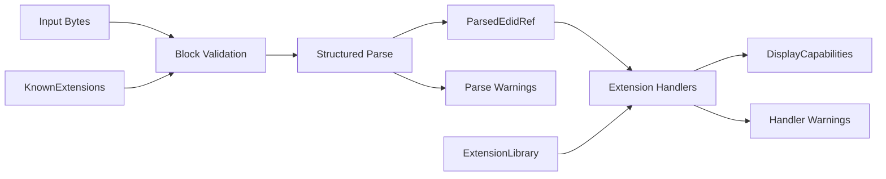
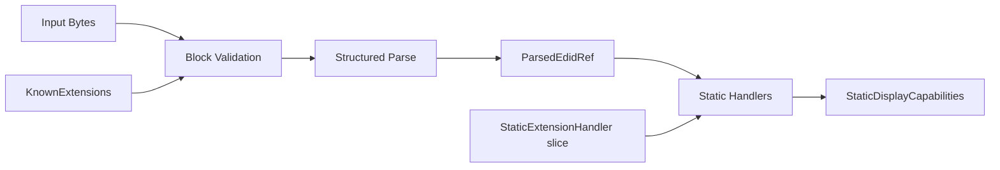

# Architecture

PIAF is organized as a small library with clear internal boundaries between byte-level parsing and higher-level capability modeling.

## Scope

PIAF reads and interprets EDID data as an input to display capability discovery.

The library covers:

- parsing and validation of raw byte slices — header verification, checksum, and block structure,
- full decoding of the EDID base block into typed fields,
- extension block dispatch via a pluggable handler system,
- full CEA-861 extension decoding covering all major data block types,
- full DisplayID 1.x extension decoding covering all 20 defined block types,
- conversion into a stable `DisplayCapabilities` consumer model,
- structured diagnostics: hard errors for structurally invalid input; warnings for malformed, unknown, or suspicious content.

The following are out of scope:

- a full HDMI implementation,
- packet generation or serialization,
- driver development,
- electrical or PHY-level signaling,
- vendor-specific behavior beyond safe parsing,
- broad platform integration.

### Decoding philosophy

PIAF decodes everything a specification defines. No field is omitted because it appears
obscure or unlikely to be needed. Consumers decide which fields matter for their use case;
the library makes no judgement about importance.

`Option` fields communicate *presence or absence* — whether the source data contained a
value — not whether that value is considered significant. A field that is `None` was absent
or undecodable in the source; a field that is `Some` reflects what the display reported,
regardless of whether any particular consumer cares about it.

This principle applies to new block types as they are implemented: once a block's wire
format is specified, all of its defined fields are decoded into the model.

## Core pipeline

Two capability pipelines operate on any `EdidSource` — either `ParsedEdidRef<'_>` (zero-copy,
from `parse_edid`) or `ParsedEdid` (owned, from `parse_edid_owned`). Choose one pipeline per
call site:

**Dynamic pipeline** (`alloc`/`std`) — full metadata extraction, heap-allocated output:

**Static pipeline** (all tiers, including bare `no_std`) — mode extraction, fixed-capacity output:

## Layers

### Input

The input layer is responsible only for obtaining byte buffers. In the earliest versions of PIAF, this is simply a caller-provided byte slice.

Future versions may include helpers for reading from platform-specific sources, but transport concerns should remain outside the core parser.

### Parser

The parser is responsible for:

- validating expected block sizes,
- checking structural markers,
- verifying checksums,
- decoding known fields into structured Rust types.

The parser should avoid embedding higher-level policy decisions where possible.

### Intermediate representation

`ParsedEdidRef<'_>` (zero-copy, borrowed) and `ParsedEdid` (owned, copied) both preserve the
structure of the decoded data closely enough to support inspection, debugging, and later
refinement. Both implement `EdidSource`, which is the abstraction the capability pipelines
work against.

`ParsedEdidRef<'_>` is the primary output of `parse_edid` — it borrows block data directly
from the input slice without copying. `ParsedEdid` is available via `parse_edid_owned` for
cases where the result must outlive the input buffer.

This representation is distinct from the end-user capability model.

### Normalization

The normalization layer converts parsed fields into a consumer-facing output structure. Two
pipelines do this work:

- **Dynamic pipeline** — `capabilities_from_edid` with `ExtensionLibrary`. Produces
  `DisplayCapabilities` with `Vec<VideoMode>`, rich extension metadata (audio, VSDB,
  colorimetry, HDR), and type-erased `Arc<dyn ExtensionData>` slots. Requires `alloc` or
  `std`.

- **Static pipeline** — `capabilities_from_edid_static` with a `&[&dyn StaticExtensionHandler]`
  slice. Produces `StaticDisplayCapabilities<N>` with a fixed-capacity mode array and the same
  scalar fields. Available at all build tiers. When called with a `ParsedEdidRef<'_>`, extension
  blocks are processed even in bare `no_std` — the borrowed slice requires no allocator.

Both pipelines share all internal parsing logic through the `ModeSink` trait abstraction.

Normalization does not invent data. If a field cannot be reliably determined, it is left absent
rather than filled with a default.

### Diagnostics

Diagnostics should distinguish between:

- **hard errors**, which prevent useful parsing,
- **warnings**, which indicate malformed, unsupported, or suspicious but non-fatal data.

This distinction is important because real display data is often imperfect. Warnings are collected from both the parser and the extension handlers and surfaced on the output structures.

In `alloc`/`std` builds, warnings are stored as `ParseWarning` — a type-erased
`Arc<dyn Error + Send + Sync + 'static>`. This keeps the warning channel open to custom
extension handlers, which can push their own error types without modifying the core
`EdidWarning` enum. Built-in library code emits `EdidWarning` variants; callers use
`downcast_ref` to recover concrete types. In bare `no_std` builds, warnings are stored
as `EdidWarning` values directly.

## Design principles

- Keep byte parsing deterministic and testable
- Keep capability modeling stable and ergonomic
- Avoid coupling transport, parsing, and policy logic
- Prefer explicit types over loosely structured maps or tuples
- Never invent data — absent information is represented as `None`, not as a guess

### DisplayCapabilities is a data struct, not a decision layer

`DisplayCapabilities` holds decoded values from the EDID — nothing more. Methods that
compute derived results (preferred mode, bandwidth checks, HDR detection, DPI, mode
filtering) do not belong on the struct.

Helpers of this kind belong in [`display-types`](https://crates.io/crates/display-types) as
free functions that accept `&DisplayCapabilities` as input. Keeping them there makes them
available to all consumers of the shared type library without depending on the parser, and
avoids encoding policy or heuristics into what is fundamentally a decoded representation.

## Technical constraints

- **`no_std` compatibility**: The core library avoids the Rust standard library to remain usable in firmware, bootloaders, and embedded systems. `alloc` may be used where dynamic allocation is required (e.g., for extension block storage and the dynamic handler pipeline). The static pipeline and all scalar field decoding are available without any allocator.
- **Zero-copy**: `parse_edid` returns `ParsedEdidRef<'_>`, which borrows the base block and all extension blocks directly from the input slice. No block data is copied unless `parse_edid_owned` is called explicitly.
- **Dead-code warnings in bare `no_std` builds**: Without `alloc` or `std`, the handler layer is absent and the `pub(crate)` decode functions on model types (e.g. `ManufactureDate::from_edid_bytes`) appear unused. These functions are intentionally left available — a consumer with no handler pipeline can still call them directly. A blanket `#![cfg_attr(not(any(feature = "alloc", feature = "std")), allow(dead_code, unused_imports))]` in `lib.rs` suppresses the noise without removing the items.

